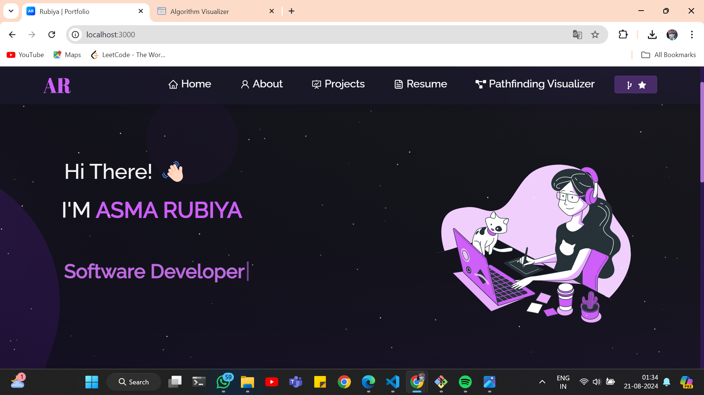

<h2 align="center">
  Portfolio Website - v2.0 
  <a href="https://ar-portfolio-two.vercel.app/" target="_blank">rubiya.dev</a>
</h2>

  

 

   &nbsp;
   &nbsp;
   &nbsp;
   &nbsp;
  

<h3 align="center">
    🔹
    <a href="https://github.com/asmarubiya/Portfolio/issues">Report Bug</a> &nbsp; &nbsp;
    🔹
    <a href="https://github.com/asmarubiya/Portfolio/issues">Request Feature</a>
</h3>

## Overview

Welcome to my portfolio website, <a href="https://ar-portfolio-two.vercel.app/" target="_blank">rubiya.dev</a>. This site serves as a comprehensive showcase of my work, highlighting selected GitHub projects, my resume, and an overview of my technical skills.

This portfolio is designed to provide a clear, interactive experience, allowing visitors to explore my projects, understand my expertise, and connect with me easily.

## Technology Stack

This project was crafted with a strong focus on modern web development technologies:

- **React.js**: For building a dynamic and responsive user interface.
- **Node.js** and **Express.js**: To manage the backend and server-side operations.
- **CSS3**: For styling and creating an aesthetically pleasing design.
- **VsCode**: As the primary code editor, ensuring efficient and streamlined development.
- **Vercel**: For seamless deployment and hosting of the website.

## Features

- **📖 Multi-Page Layout**: Organized structure for easy navigation.
- **🎨 Customizable Styling**: Styled using React-Bootstrap and CSS, with easy-to-modify color schemes.
- **📱 Fully Responsive Design**: Optimized for viewing on any device, ensuring accessibility and usability across platforms.

## Getting Started

Clone this repository to start working on it. Make sure you have `node.js` and `git` installed globally on your machine.

## 🛠 Installation and Setup Instructions

1. Install dependencies: `npm install`
2. Run the application: `npm start`

The app will run in development mode at [http://localhost:3000](https://ar-portfolio-two.vercel.app/), where you can see your changes live as you edit.

## Usage Instructions

All components are located in the `/src/components/` directory. You can easily edit the components to customize the content to your needs.

### Show your support

If you find this project useful or interesting, please consider giving it a ⭐ on GitHub to show your support!
